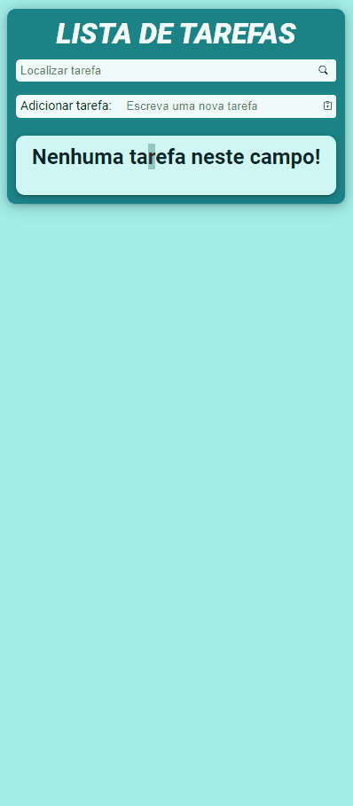

# Lista de Tarefas - Tiago Forward

## Tabela do Conteudo

<ul>
<li><a href="#sobre">Sobre</a></li>
<li><a href="#desafio">Desafio</a></li>
<li><a href="#status">Status</a></li>
<li><a href="#objetivo">Objetivo</a></li>
<!-- <li><a href="#curiosidade">Curiosidade</a></li> -->
<li><a href="#tecnologias">Tecnologias</a></li>
</ul>

## Sobre

Meu primeiro projeto utilizando React, a proposta é desenvolver uma lista de tarefas com diversas funcionalidades!

## Desafio

Durante o desenvolvimente do código, me deparei com alguns desafios que serão citado abaixo:

<li>1 – Um deles foi ao criar um Hook Personalizado useTaskData, na qual eu estava importando e utilizando para gerenciar o estado das tarefas em dois componentes (SearchForm e TaskContainer) no qual fazia com que não atualiasse na tela a nova tarefa que foi adicionada no array, pois o useTaskData estava criando seu próprio estado separado.
Para solucionar esse problema, foi importado o estado do useTaskData apenas no componente pai Home, passando como props aos componentes filhos. 

 

<li>2 – Outro grande desafio foi ao clicar no butão de estrela da tarefa, mandar o componente inteiro para um novo container de tarefas como favoritas, e também permanecer funcionando o botão de excluir tarefa. Tive que adicionar várias condições ao adicionar e excluir o componente, e implementei também uma nova filtragem após essas condições para atualizar as minhas duas listas de tarefas.

## Status

Desafio em andamento. 👌

## Objetivo

Com base nos conceitos adquiridos nos cursos Dev Quest, tinha como objetivo aprender a manipular e a utilizar da melhor forma o display grid.

<li>Etapa 1 – Nesta etapa, inicializei meu código com npm create vite@latest e criei minha estrutura de pastas inicial!

    1 – Inicializando projeto; ✅
    2 – Montando a estrutura inicial de pastas;✅
    3 – Metodologia de abordagem Mobile-fist. ✅

<li>Etapa 2 – Criando o container principal e seus componentes.

    1 – Componente de navegação e formulário; ✅
    2 – Componente de tarefas que incluem o container e a tasks. ✅

<li>Etapa 3 – Instalando a biblioteca styled-components para um uso mais dinâmico do css.

    1 – Adicionando estilizações nos components; ✅
    2 – Criando um estilo global com createGlobalStyled; ✅
    3 – Criando variáveis de cores. ✅

<li>Etapa 4 – Adicionando funcionalidade ao meus componentes.

    1 – Adicionar funcionalidade de adicionar tarefa; ✅
    2 – Adicionar funcionalidade de excluir tarefa; ✅
    3 – Adicionar funcionalidade de adicionar aos favoritos; ✅
    4 – Adicionar funcionalidade de ao adicionar aos favoritos excluir da lista anterior. ✅

<!-- ## Curiosidade -->

## Tecnologias

<ul>
<li>HTML</li>
<li>CSS</li>
<li>JavaScript</li>
<li>React</li>
<li>GIT</li>
</ul>
