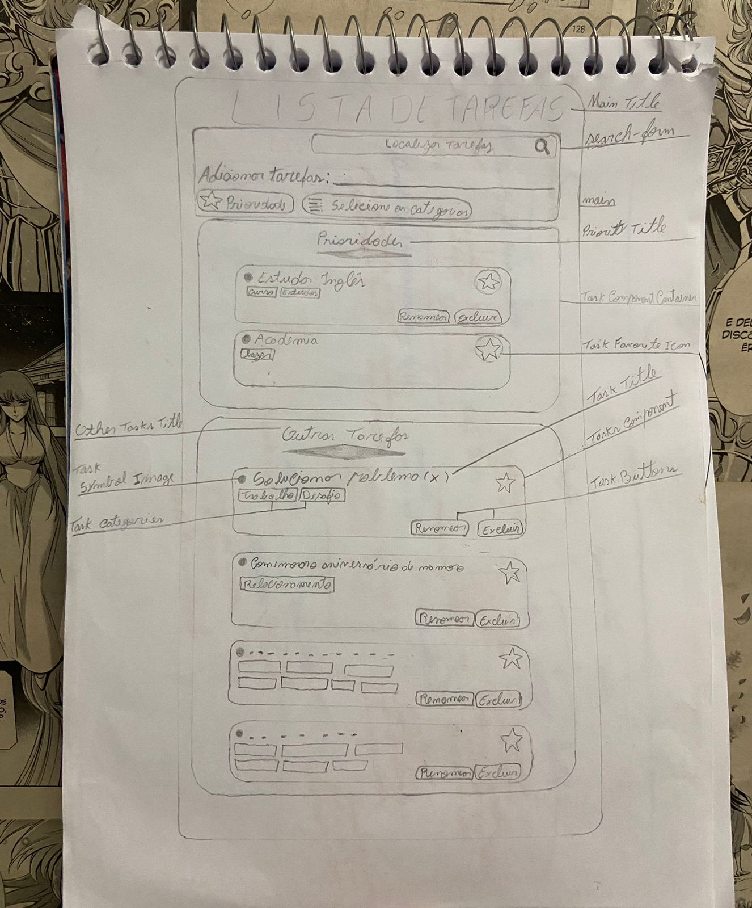
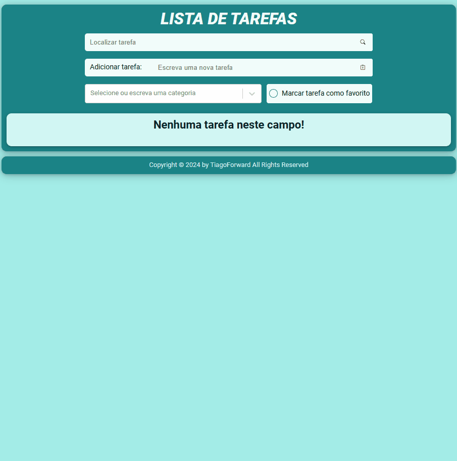

# Lista de Tarefas - Tiago Forward

## Tabela do Conteudo

<ul>
<li><a href="#sobre">Sobre</a></li>
<li><a href="#desafio">Desafio</a></li>
<li><a href="#status">Status</a></li>
<li><a href="#objetivo">Objetivo</a></li>
<li><a href="#curiosidade">Curiosidade</a></li>
<li><a href="#tecnologias">Tecnologias</a></li>
<li><a href="#instalando-e-executando-o-projeto">Instalação</a></li>
<li><a href="#acessando-o-site">Acessando o site</a></li>
</ul>

## Sobre

Meu primeiro projeto utilizando React, a proposta é desenvolver uma lista de tarefas com diversas funcionalidades! 😀




## Desafio

Durante o desenvolvimente do código, me deparei com alguns desafios que serão citado abaixo:

<li>1 – Um deles foi ao criar um Hook Personalizado useTaskData, na qual eu estava importando e utilizando para gerenciar o estado das tarefas em dois componentes (SearchForm e TaskContainer) no qual fazia com que não atualiasse na tela a nova tarefa que foi adicionada no array, pois o useTaskData estava criando seu próprio estado separado.
Para solucionar esse problema, foi importado o estado do useTaskData apenas no componente pai Home, passando como props aos componentes filhos. 

<br/>

<li>2 – Outro grande desafio foi ao clicar no botão de estrela da tarefa, mandar o componente inteiro para um novo container de tarefas como favoritas, e também permanecer funcionando o botão de excluir tarefa. Tive que adicionar várias condições ao adicionar e excluir o componente, e implementei também uma nova filtragem após essas condições para atualizar as minhas duas listas de tarefas.

<br/>

<li>3 – Outro desafio fo tentar descobrir como passar o valor do meu input que estava no componente filho para o componente pai, na qual eu tentei várias vezes passar de forma totalmente errada, até aprender que eu poderia passar esse valor através de uma função criada no componente pai e atribuíndo como props no componente filho, na qual esta função vai receber o valor do estado que foi criado dentro do componente filho.  


## Status

Desafio concluído. 👌👨‍💻



## Objetivo

<li>Etapa 1 – Nesta etapa, inicializei meu código com npm create vite@latest e criei minha estrutura de pastas inicial!

    1 – Inicializando projeto; ✅
    2 – Montando a estrutura inicial de pastas;✅
    3 – Metodologia de abordagem Mobile-fist. ✅

<li>Etapa 2 – Criando o container principal e seus componentes.

    1 – Componente de navegação e formulário; ✅
    2 – Componente de tarefas que incluem o container e a tasks. ✅

<li>Etapa 3 – Instalando biblioteca de estilo como styled-components e react select.

    1 – Adicionando estilizações nos components; ✅
    2 – Criando um estilo global com createGlobalStyled; ✅
    3 – Criando variáveis de cores; ✅
    4 – Utilizando styled-components tornando o estilo de css mais dinâmico; ✅
    5 – Adicionado categorias e ajustado o estilo do componente do react select. ✅

<li>Etapa 4 – Adicionando funcionalidade ao meus componentes.

    1 – Adicionado funcionalidade de adicionar tarefa; ✅
    2 – Adicionado funcionalidade de excluir tarefa; ✅
    3 – Adicionado funcionalidade de adicionar aos favoritos; ✅
    4 – Adicionado funcionalidade de ao adicionar aos favoritos excluir da lista anterior; ✅
    5 – Adicionado funcionalidade do botão de marcar como favorito, direcionando as tarefas diretamente no container favoritos caso esteja marcado; ✅
    6 – Adicionado funcionalidade na seleção de categorias; ✅
    7 – Adicionado funcionalidade de localizar tarefa; ✅
    8 – Adicionado funcionalidade de ao clicar na estrela da tarefa, além de adicionar a lista de favoritos, também mudar a cor; ✅
    9 – Adicionado funcionalidade de ao pressionar a tecla 'Enter', adicionar a tarefa. ✅

## Curiosidade

Está sendo muito satisfatório, cada funcionalidade nova que aprendo ou depois de muita luta, consigo fazer funcionar.🥰

## Tecnologias

<ul>
<li>HTML</li>
<li>CSS</li>
<li>JavaScript</li>
<li>React</li>
<li>GIT</li>
</ul>

## Instalando e executando o projeto

1º Clone o repositório do projeto em HTTPS ou SSH com sua SSH key

HTTPS
```bash
  git clone https://github.com/tiago-forward/my-project-to-do-list.git
```

SSH
```bash
  git clone git@github.com:tiago-forward/my-project-to-do-list.git
```

Em sua máquina, crie uma nova pasta e execute o git, e em seguida cole um dos links acima.
<br>

2º Entre no diretório do projeto na qual foi clonado

```bash
  cd my-project-to-do-list
```

3º Execute o comando abaixo para instalar todas as dependências utilizadas

```bash
  npm install
```

4º Inicialize a aplicação para ver o código funcionando na web

```bash
  npm run dev
```

## Acessando o site

Para acessar meu projeto online, acesse esse link : <a href="https://desafio-react-avancado-pokedex.vercel.app/" target="_blank">Desafio React Avançado | Projeto Pokédex</a>